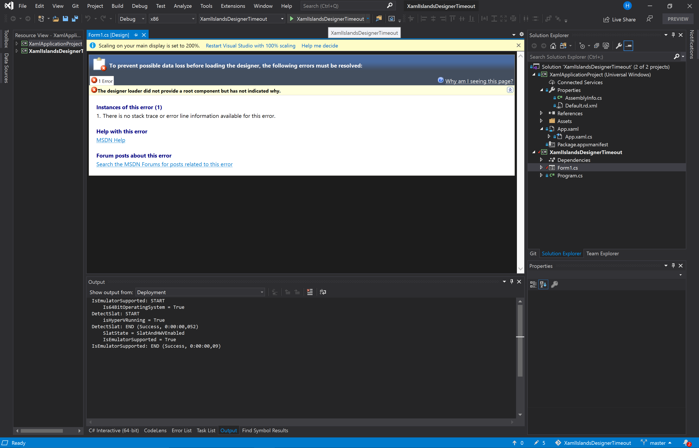
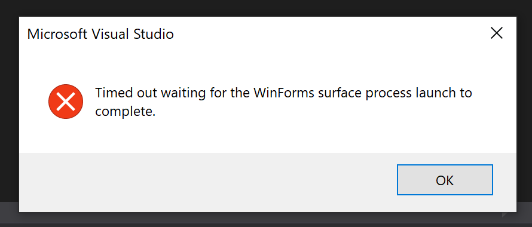

Bug reproduction for .Net Core Windows Forms designer
=====

# Introduction
This repository is a bug reproduction for the feedback [`.Net Core WinForms times out when opening Form`](https://developercommunity.visualstudio.com/content/problem/1110297/net-core-winforms-times-out-when-opening-form.html).

There seems to be an issue when referencing the UWP project containing the `XamlApplication` class from the Windows Forms project.

I got two possible results, and the result you get might depend on whether you cleaned / rebuilt the solution or not.

Result A:
- error page on the Designer tab that was already open (see screenshot below)
- Shortly afterwards: Visual Studio crash

Result B:

# Approach 1
1. Open Visual Studio
1. Open the solution.
1. Set your solution configuration to `Debug`, `x86`.
1. Ensure `Form1.cs` is not opened
1. Add a project reference from XamlIslandsDesignerTimeout to `XamlApplicationProject`
1. Try opening `Form1.cs` in the Designer

# Approach 2
1. Open Visual Studio
1. Open the solution.
1. Set your solution configuration to `Debug`, `x86`.
1. Open `Form1.cs` in the Designer and leave it open
1. Add a project reference from XamlIslandsDesignerTimeout to `XamlApplicationProject`
